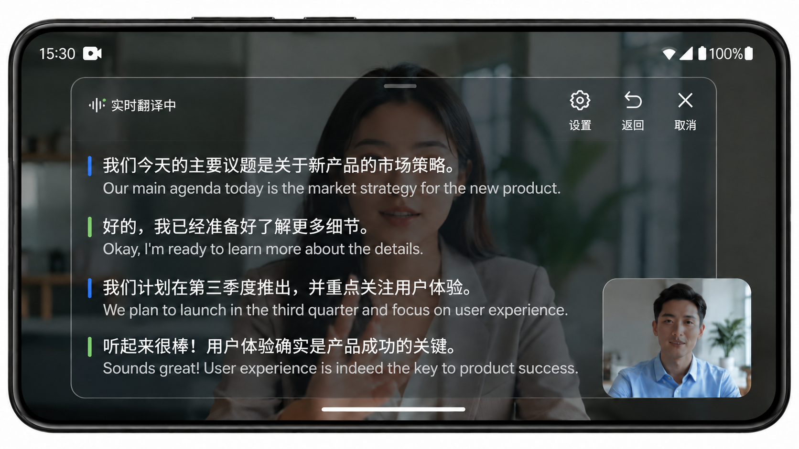

# EyeOpener - 实时悬浮字幕翻译

[](LICENSE)
[](#语言支持)
[](#构建)

Android 实时语音翻译应用：全局悬浮字幕 + 多引擎 ASR + 多引擎翻译，离线可用。

> README in English: [README.en.md](README.en.md)



## 功能特性

- 🎙️ **全局悬浮字幕**：任意 App 之上实时显示原文+译文，可拖拽/缩放
- 🌐 **41 种语言识别**：X-ASR 中英 + Nemotron 3.5 多语种 + Vosk 小语种
- 🔄 **三档翻译引擎**：本地 ML Kit 离线 / 云端（Papago/百度/DeepL/Azure/Google）/ AI 大模型
- 📱 **响应式布局**：手机 / 折叠屏 / 平板 / 悬浮窗
- 🎨 **个性化**：颜色、字号、透明度、显示模式（原文/译文/双语）
- 📝 **历史记录**：Room 本地存储，支持收藏/导出
- 🔒 **隐私优先**：API Key AES/GCM 加密存储，离线模式可用


## 语言支持

| ASR 引擎 | 服务语种 | 模型大小 | 特点 |
|----------|----------|----------|------|
| Sherpa-ONNX X-ASR | zh / en（含混说） | 161 MB | 960ms 流式，CER ~9.59%，自带标点 |
| Sherpa-ONNX Nemotron 3.5 | 26 语种 | 685 MB | 320ms 流式，per-stream 动态切语种 |
| Sherpa-ONNX BN Vosk | bn | 87 MB | 孟加拉语 Zipformer 流式 |
| Vosk Small | 33 语种（含 en-in 变体） | 38–100 MB | 100–300ms 真流式，轻量离线 |

**ASR 引擎与翻译引擎解耦**：ASR 仅由源语言**唯一决定，不做 fallback** —— 模型未下载时提示去下载，不会自动切换引擎。所有翻译引擎共用同一套 ASR 分流逻辑：

| 源语言 | ASR 引擎 |
|--------|----------|
| zh / en | X-ASR |
| bn | BN Vosk |
| Nemotron 26 语种 | Nemotron 3.5 |
| 其他 | Vosk |

### 翻译引擎

| 引擎 | 后端 | 特点 |
|------|------|------|
| LOCAL | ML Kit 离线 | 响应最快，需 Google Play Services |
| CLOUD | Papago / 百度 / DeepL / Azure / Google | 多语种覆盖广，需 API Key |
| AI | 7 家 LLM Provider | 上下文感知 + 智能润色 + 助手 |

不支持语种时上层静默跳过，不弹错误。

### 模型下载源

| 模型 | 源 |
|------|----|
| Vosk ASR | alphacephei.com |
| X-ASR 中英 | ModelScope（bujidc） |
| Nemotron 3.5 多语种 | HuggingFace（csukuangfj2） |
| Sherpa-ONNX BN | GitHub Release（k2-fsa） |
| ML Kit 翻译 | Google Play Services |

### 音频参数

- 采样率：16kHz / mono / 16bit PCM
- 帧大小：480 samples (30ms)
- VAD：Silero VAD（32ms / 512 samples 窗口，assets 内置）
- 音频输入：麦克风 / AudioPlaybackCapture（Android 10+）

## 构建

```bash
./gradlew assembleDebug      # Debug 构建
./gradlew assembleRelease    # Release 构建
./gradlew :app:dependencies  # 查看依赖
```

**环境要求**：
- Android Studio Ladybug+
- JDK 17+
- Android SDK 36
- minSdk 24 (Android 7.0)
- NDK（编译原生库）

## 原生库

| 库 | 用途 | 来源 |
|----|------|------|
| `eye_native` | AGC 音频处理 JNI | `app/src/main/cpp/` |
| sherpa-onnx-jni | Sherpa-ONNX JNI | 预编译 `jniLibs/` |
| onnxruntime | ONNX 推理 | 预编译 `jniLibs/` |
| vosk-android | Vosk ASR | Maven |
| Silero VAD | 语音活动检测 | `assets/silero_vad.onnx` |

## 致谢

本项目使用了以下优秀的开源项目：

- [sherpa-onnx](https://github.com/k2-fsa/sherpa-onnx) — 端侧实时语音识别（Apache-2.0）
- [Vosk](https://alphacephei.com/vosk/) — 多语种离线语音识别（Apache-2.0）
- [Silero VAD](https://github.com/snakers4/silero-vad) — 语音活动检测（MIT）
- [X-ASR](https://github.com/Gilgamesh-J/X-ASR) — 中英混说 ASR（Apache-2.0）
- [Nemotron 3.5 ASR](https://huggingface.co/nvidia/nemotron-3.5-asr-streaming-0.6b) — 多语种 ASR（OpenMDW-1.1）

第三方 SDK：

- [ML Kit](https://developers.google.com/ml-kit) — Google 端侧机器翻译（闭源，需 Google Play Services）

## 开源协议

[Apache License 2.0](LICENSE)

```
Copyright 2026 zt-Fang (EyeOpener)
```

第三方库与模型遵循其各自协议。
